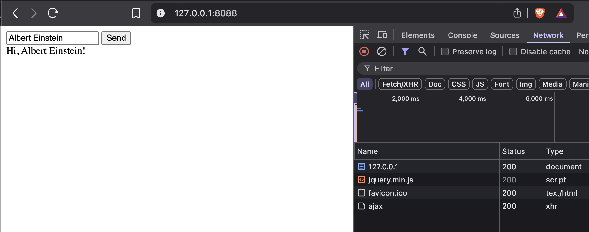

# go-ajax
ajax call to golang
<br>
Sample golang with ajax call
<br>
<br>
ScreenShot</img>
<br>
<br>
Init:<br>
```go mod tidy```
<br>
Compile:
```go build -o ajax main.go```
<br>
Running:
```./ajax```
